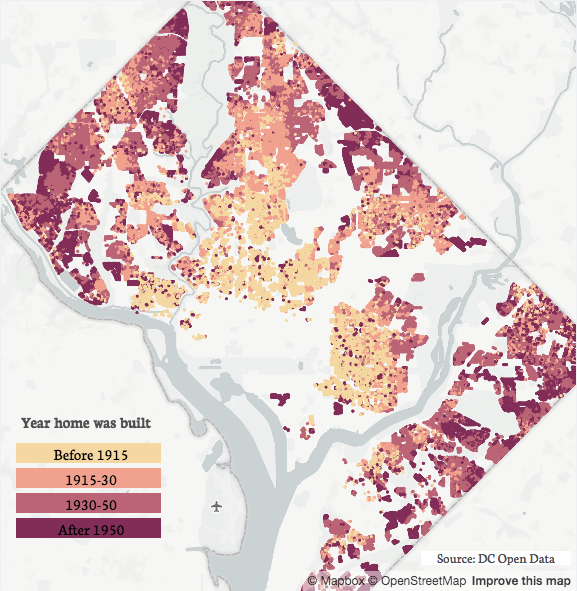
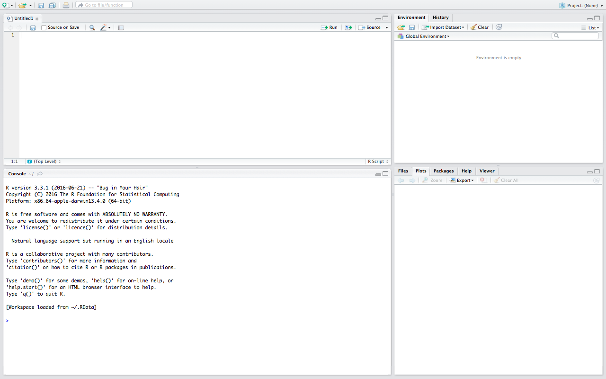

<center></center>

---

#Today I hope everyone:
* Learns about the open data landscape in DC. 
* Gains familiarity with R
* Builds a foundation of data analysis and visualization in R
* Learns about DC through open data!

###Find the presentation and data we're using here: http://bit.ly/2cBtK2S

<br>

---

#Who Am I?


### Oh, hi, I'm Kate. 
I like to analyze and visualize data about the District for my website, [DataLensDC](http://www.datalensdc.com/). My work's been featured on CityLab, GGWash, Washingtonian, and Washington City Paper, among others. 

I'm the Data Lead for [Code for DC](http://codefordc.org/), a civic hacking organization you should all join! 

I'm also a co-organizer of this year's [Tech Lady Hackathon](http://techladyhackathon.org/), a one day *free* hackathon and learning workshop for women. 

From 9-5 M-F I'm an Economist for the U.S. government. 

You can find me on [Twitter](https://twitter.com/DataLensDC) at the handle @datalensdc or by e-mail at datalensdc@gmail.com.

<br>

---

#DC's Open Data
### There is a lot of data about DC publicly available through the federal or city government. 
The most comprehensive sites are:

* For federal-level data: [data.gov](https://www.data.gov/)

* For city-level data: [opendata.dc.gov](http://opendata.dc.gov/)

But these are by no means exhuastive!

Open data has many homes on the web. I've created a DC-specific list of data [here](https://github.com/katerabinowitz/ManyHomesofDCData). Keep an eye out for a new open data website from Code for DC which aims to be an exhaustive repository. 

### There is also a lot of data not publicly available. 
If there is data you are interested and think the government has it, FOIA for it. This is not as daunting as it may seem. Here's [my FOIA guide.](https://github.com/katerabinowitz/FOIA-Requests). 

### Here are some cool things made with open data:

* All my [DataLensDC](http://www.datalensdc.com/) blog posts.
* [Home Fire Risk Map](http://www.datakind.org/blog/american-red-cross-and-datakind-team-up-to-prevent-home-fire-deaths-and-injuries), created by [DataKindDC](http://www.meetup.com/DataKind-DC/)
* [Per-Student Funding](http://dcpsbudget.ourdcschools.org/), created by [Code for DC](http://codefordc.org/)
* [Tons](https://www.washingtonpost.com/graphics/local/metro-history-failures/) [and](http://www.washingtoncitypaper.com/news/article/20782284/charts-in-dc-elections-majority-doesnt-rule) [tons](http://mobilitylab.org/2016/09/09/waba-regional-bike-lane-map/) [of](http://www.urban.org/features/our-changing-city-collection) [news](https://districtmeasured.com/2016/08/23/d-c-s-cashiers-and-janitors-are-more-likely-to-live-in-the-city-than-other-workers-but-thats-changing/) [stories](https://wamu.org/news/16/07/13/permitting_problems_do_you_know_who_s_working_on_your_house_in_dc_it_s_not_clear) [and](http://time.com/4347614/washington-dc-metro-worst-stations/) [visualizations](http://open.dc.gov/econintel-cotw/).

<br>

---

#RStudio: Where We'll be Working Today
<center></center>

###R Studio is the primary working environment for R programming and it's split into four different panels. 
* __The bottom left is the Console__. Code entered here immediately executes and can't be saved to file. Let's try a few simple math equations in the Console!
* __The top left panel has tabs for R files and Data.__ Here you can create, edit, and view R files that hold your code. You can also view your data. 
* __The top right panel has tabs for the Environment and History__. The environment tab is a list of the (mostly) data you have loaded for your session. The history tab shows your history of R coding. Whether or not it was saved to a file! History is also searchable. 
* __The bottom right panel includes the Help and Plots tabs.__ Help holds descriptions and examples for R functions. Plots displays the graphics you've created. Other tabs show files and packages. 

<br>

---

#Some of R's best features don't come pre-loaded. 
R is open source. There is base functionality that comes standard with R, but many of the best features in R come through packages. Packages are created by users and contain data or functions to address a given task in R. To use a package it must first be installed on your computer. Then you need the load the package once per session. 

###Today we're going to be using two packages:

* __dplyr__ for manipulating data
* __ggplot2__ for visualizing data

###Let's get those packages!
```{r eval=FALSE}
install.packages(dplyr) #installs package to your computer
install.packages(ggplot2)
```

And load them in our current session. 
```{r}
require(dplyr) #loads package to session
require(ggplot2)
```


<br>

---

#A handful of things to always keep in mind with R
__On syntax__:

* R is always case-sensitive. Syntax is also not always consistent across packages.
    + I get __many__ errors solely due to typos. This is always a good first check.

* Functions are always formatted as such:
    + function (argument1, argument2)
    + The function name always goes first and the arguments follow, separated by commas and enclosed in parentheses.
    + We'll see lots of examples!

* When your console returns '+' it means the function is still open. You probably forgot a close parentheses. 

* Use # to make comments in R - text that won't run as code. Be kind to your future self and comment often!

__On learning to code in R__:

* ?function or help(function) are your best friends in RStudio.

* Search engines and StackOverflow are your best friends outside of RStudio.

* There can be many different approaches to solving a single problem. 

* This is a learned skill and it's not always easy. 
<br>

---

#Let's dive into the data!
The data we're working with today can be found [here](https://github.com/katerabinowitz/CodeHer16/tree/master/data). It is DC population statistics by ward from 1990, 2000, and 2010 from [NeighborhoodInfoDC](http://www.neighborhoodinfodc.org/), an Urban Institute project. 

###Let's get that data into R. 
```{r}
dcPop<-read.csv("https://raw.githubusercontent.com/katerabinowitz/CodeHer16/master/data/dcPopulation.csv")
```

###And we have our first data frame!
A data frame is a table of data made of rows (each observation) and columns (each variable). We've just created our first, named dcPop. You should see it in your environment tab to the right. 

###We also performed one of our first functions - read.csv! 
How'd that work?

* The new object you're creating always goes first (dcPop).  
* <- is the assignment operator. This means everything to the right of <- is used to create the object ("assign value") on the left. 
* read.csv reads in a comma-separated value file to create a data frame.
    + The *function* is read.csv and the *argument* is the location of the file you're reading in. 
    + The file can come from a url or your computer, i.e. ("/Users/katerabinowitz/Documents/Talks/CodeHer16/data/dcPopulation.csv")
    + for more details and arguments do: ?read.csv

<br>

---

###How does our data frame look? We can use the __str__ to check the structure of the data.
```{r}
str(dcPop)
```
###Wait! Where did that <- go?
When we ran

dcPop<-read.csv("https://raw.githubusercontent.com/katerabinowitz/CodeHer16/master/data/dcPopulation.csv")

It created the data frame dcPop, which appears in our environment and we can open or reference anytime this session. In fact, we just referenced it in the function str(dcPop)!

<- notation created dcPop. See what happens when we just run the read.csv function:
```{r}
read.csv("https://raw.githubusercontent.com/katerabinowitz/CodeHer16/master/data/dcPopulation.csv")
```
It works! But nothing is saved. All the data outputs to the console and it can't be used or referenced again. 

When we use the read.csv function we want to save that data to the environment so we can use it again.

With the str() function we don't need to save or use it's output, which describes the structure of our data frame.

<br>

---

###Okay, back to the structure of our data frame.
```{r}
str(dcPop)
```
This is the structure of our 'data frame', or our table of data. Let's take a moment to walk through it. 

* There are 9 variables and 24 observations. 

* Specific variables within a dataset can be referenced by putting a dollar sign between the data frame and variable names, like this: dataframe$variable.

Let's try:
```{r}
dcPop$ward
```

* Variables can come in three different types:
    + character (for text variables) 
    + numeric (for numerical variables, which may be integer or numeric. What's the difference?)
    + factors (for categorical variables, which have a numeric value there refers to a category. for instance, 0 means no, 1 means yes.)

<br>

---

#Changing variable types
The variable ward is currently stored as a number. Does that make sense?

Let's change it to a factor, along with the variable year. 
```{r}
dcPop<- mutate(dcPop, ward = factor(ward), year=factor(year))
```

### Did it work? Let's check.
```{r}
str(dcPop)
```

<br>

---

#Let's get a quick summary of the data.
```{r}
summary(dcPop)
```

### Maybe you're only interested a statistic of a single variable, like DC's total population.
```{r}
sum(dcPop$totalPop)
```

<br>

---

#Does that sum make sense?
### Let's think about how the data is structured....
Maybe even look at the data by clicking the data frame on the Environment tab.

We want DC's total population, the sum of each Ward's population, __by__ year.
```{r}
dcGroup <- group_by(dcPop, year)
totalPop <- summarise(dcGroup,
                        dcPop = sum(totalPop)
)
totalPop
```


<br>

---

#Let Graph it!
###ggplot is the most popular R graphics function and what we'll be using today. 
The ggplot() function is how evey graphic starts, and the first argument is the dataset you're using. "aes" refers to the aesthetic of the graph, which at a minimum is the X and Y variables. This sets the graphical environment. Let's see what that looks like. 
```{r}
ggplot(totalPop, aes(x=year, y=dcPop))
```

But where's the data? We haven't added that yet. After the ggplot() function you can add (literally with a "+") layers, the first of which is the geometric objects we want to add to the graph. For a bar graph we use "geom_bar." We want the bar height to equal DC's population, our Y, hence stat="identity." 
```{r}
ggplot(totalPop, aes(x=year, y=dcPop)) + 
  geom_bar(stat="identity")
```

There are many different layers you can add on to change the styling and notation, but for now let's keep it simple. 

<br>

---
 
# Are there any differences in population changes by ward? 
###Let's say I only want to compare 1990 to 2010
We'll need to filter the data.
```{r}
dcPop9010 <- filter(dcPop, year != 2000)
```

### Let's take a minute to discuss operators
Operator      | Defintion
------------- | ------------- 
< | less than
<=	| less than or equal to
>	| greater than
>=	| greater than or equal to
==	| exactly equal to
!= | 	not equal to
!x |	Not x
"x | y" |	x OR y
x & y	|x AND y
isTRUE(x)	| test if X is TRUE

###Let's play a game of filters and operators!

<br>

---

#Graphing population changes by ward
 
```{r}
ggplot(dcPop9010, aes(x=year, y=totalPop, group=ward, colour=ward)) + 
  geom_line()
```

<br>

---

#How much of the population is 'working age' (18-65)?
Let's look at the variables we have. 
```{r}
names(dcPop9010)
```
Okay, so we have a variable for the percent of people under 18, and the percent of people over 65. How do we get the number of people between 18 and 65?

We can create a new variable based off the variables we already have! 
```{r}
dcPop9010<-mutate(dcPop9010,btwn1865=100-perUnder18-perOver65)
```

We have lots of variables we don't need right now. Maybe only keep what we need?

###Subsetting data
Filtering data removes specific rows based on values. Subsetting removes specific columns based on their names. 
Let's only keep, or *select*, what we need for this graph. 
```{r}
dcWrkAge<-select(dcPop9010, ward, btwn1865, year)
names(dcWrkAge)
```

###Arranging data: When and where are the lowest proportions working age populations?
Sorting data can help us see the highest and lowest values, and what those observations are. We'll *arrange* the data according to the variable btwn1865. Then we'll output the top values with head() and the bottom with tail()
```{r}
arranged <- arrange(dcWrkAge,btwn1865)
head(arranged)
tail(arranged)
```

Arranged defaults to sorting lowest to highest. To flip that, tell the function to use descending order *desc()*, like this:

arranged <- arrange(dcWrkAge,desc(btwn1865))

###Let's see this in a graph
```{r}
ggplot(dcPop9010, aes(x=ward, y=btwn1865, fill=year)) + 
  geom_bar(stat="identity",position=position_dodge())
```

---

#Okay, now it's time for you to play! 
There are four datasets [here](https://github.com/katerabinowitz/CodeHer16/tree/master/data) that are structured just like the one we've been working with. Pick one and start doing analysis/visualizations on your own or with a partner! I'll be floating around to help but don't forget RStudio's ? function too.  

The datasets are:

* dcHomeSales: Number of home sales and median sales price by Ward, 1995-2015
* dcIncome: Poverty rates and average income by Ward for 1990, 2000, and 2010
* dcPopulation: That dataset we've already been using! Includes overall population plus race and age by Ward for 1990, 2000, and 2010. 
* dcSchools: Number of schools and students, both overall and divided into Charter and DCPS, by Ward, 2001-13

###We'll share what we've worked on before the workshop ends. But also keep it up after today and let me know what you find!

---

# Before you leave...
There's a lot to learn with R and we couldn't possibly cover it all in two hours! But I do hope everyone feels comfortable and excited about programming in R. There a number of great free, online resources for continuing your R learning after today:

* [Cookbook for R by Winston Chang](http://www.cookbook-r.com/) Guide to common tasks and problems in R
* [Advanced R by Hadley Wickham](http://adv-r.had.co.nz/) Don't let the 'Advanced' scare you
* [R-Bloggers](https://www.r-bloggers.com/how-to-learn-r-2/) The most popular blog about R
* [R Cheatsheets](https://www.rstudio.com/resources/cheatsheets/) Cheatsheets for RStudio, data visualization, wrangling, and more
* [Swirl](http://swirlstats.com/) An interactive way to learn R, in R
* [StackOverflow](http://stackoverflow.com/) All the questions and answers!

#And of course, keep in touch!

    
     
